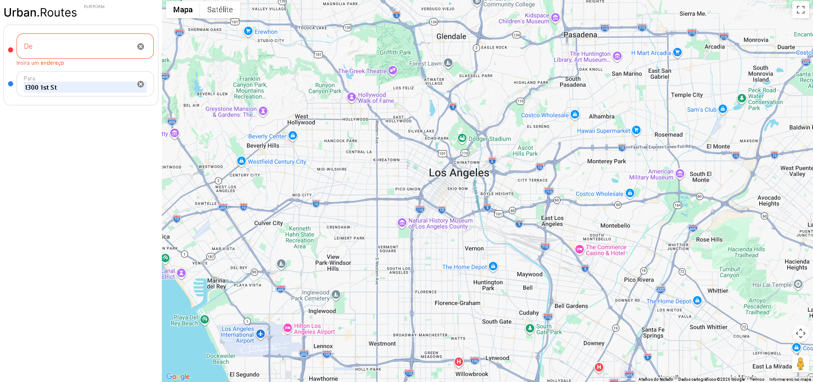

# Manual Test Cases and Bug Reports

This repository contains structured manual test cases and bug reports created to validate
the functionality and behavior of a web application.

The focus is on designing clear test scenarios, executing tests, and documenting defects
with supporting evidence.

---

## Objective

To ensure the application meets functional requirements by using well-defined test cases
and identifying defects during manual testing.

---

## What Is Included

- Structured test cases covering different user flows
- Step-by-step test execution scenarios
- Expected vs actual results documentation
- Bug reports with detailed descriptions and visual evidence
- Identification of failed, passed, and blocked test cases

---

## Test Approach

- Manual test case design
- Functional testing
- Positive and negative scenarios
- Validation of expected vs actual results
- Bug identification and reporting

---

## Bug Reports

### Map Route Not Loading After Destination Input

The map does not update to display the route after a valid address is entered in the
"To" field. The issue occurs consistently across all attempts.

- Severity: High
- Priority: High
- Jira: [KAN-15](https://joaoluizcsampaio.atlassian.net/browse/KAN-15)
- Full report: [bug-report-map-route-not-loading.md](./bug-report-map-route-not-loading.md)

---

## Tools Used

- Google Sheets
- Jira
- Manual testing techniques

---

## Project Purpose

This project was developed as part of a QA engineering bootcamp.

It demonstrates practical knowledge of:

- Manual testing
- Test case design
- Bug reporting
- Functional validation

---

## Evidence

---

## Author

João Sampaio
